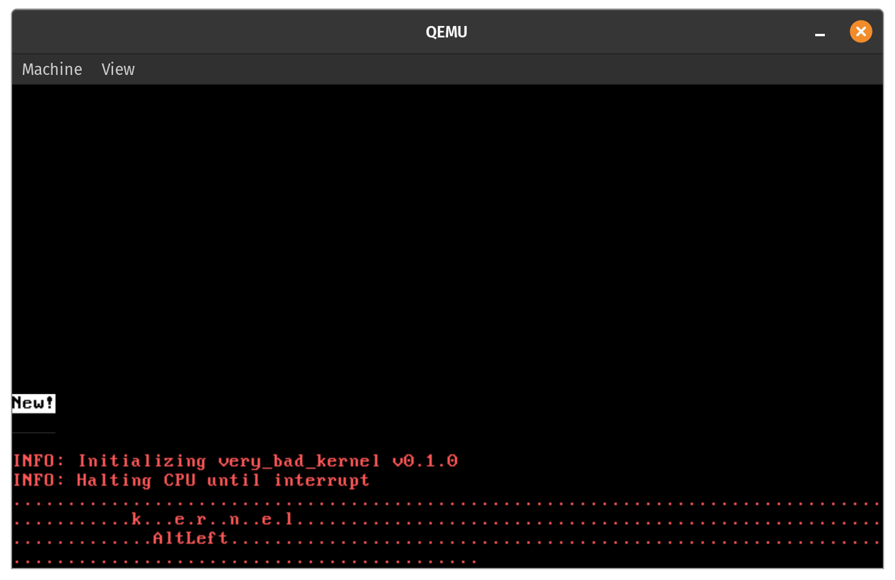

# veryBadKernel

A very bad x86_64 kernel written in Rust. All information in this readme is meant for **posix** systems (*nix, *BSD, macOS). Windows support will be added in the future.

## Features

These are all the current and planned features for this kernel. It is meant to be more of a learning opportunity instead of an actual usable kernel.

- [x] Static Rust binary (no stdlib or dynamic linking)
- [x] VGA text buffer interface
- [x] Interrupt descriptor table
- [x] Single and double fault handling
- [x] Hardware interrupts (timer, keyboard, etc.)
- [x] Memory paging
- [ ] Heap allocation
- [ ] Concurrency and multitasking




# Running the Kernel

These instructions are for if you want to run the kernel without any of the fuss of compiling.

### Prerequisites
- An installation of qemu **OR**
- A physical x86_64 machine and a USB drive

Head over to the [releases]() section and download the boot image.

### Running with QEMU

Use the `qemu-system-x86_64` command with the path to the boot image you downloaded.

```bash
qemu-system-x86_64 -drive format=raw,file=path/to/bootimage-very_bad_kernel.bin
```

### Running on Bare Metal

Use `dd` to write the boot image to a USB drive

```bash
dd if=path/to/bootimage-very_bad_kernel.bin of=/dev/<DISK_TO_WRITE>
```

After the USB is flashed, you can plug it into the machine, and select the USB drive as a boot option from your BIOS of boot manager.

# Building from Source

### Prerequisites
- Cargo and Rustup

To build and run the kernel from source, you will need a rust nightly version from 2021-12-13 or earlier:

```bash
$ rustup toolchain install nightly-2021-12-13
$ rustup default nightly-2021-12-13
$ rustup component add rust-src --toolchain nightly-2021-12-13-x86_64-unknown-linux-gnu
```

You will also need the `bootimage` tool, and the `llvm-tools-preview` component:

```bash
$ cargo install bootimage
$ rustup component add llvm-tools-preview --toolchain nightly-2021-12-13-x86_64-unknown-linux-gnu
```

### Compile & Run

Once you have all the prerequisites and toolchains installed you can clone the repository and compile the boot image:

```bash
$ git clone https://github.com/zhooda/veryBadKernel
$ cd veryBadKernel

# compile boot image without running
# the resulting bootimage binary can be found in 
# `target/x86_64-very_bad_kernel/debug/bootimage-very_bad_kernel.bin`
$ cargo bootimage

# compile boot image and run with qemu-system-x86_64
$ cargo run
```

After compiling and running, you should be able to interact with the kernel via your keyboard. Currently, the kernel only displays the name of the key pressed (capturing keyboard interrupts), and prints a `.` on every timer interrupt.